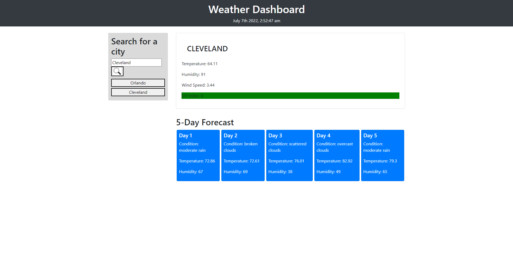

# weather-tracker

## Project Description

This project is a weather tracker that displays the current weather for a specific area, as well as the future forecast for the upcoming 5 days in that area.

## Tools Used

* HTML
* CSS (boostrap)
* Javascript (Jquery)

## Link

## Example

